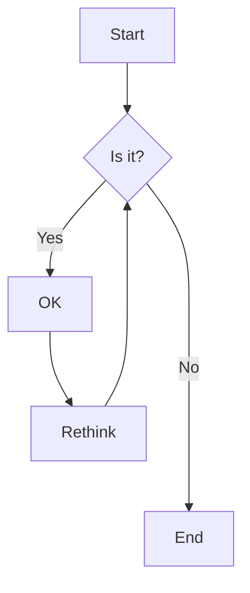
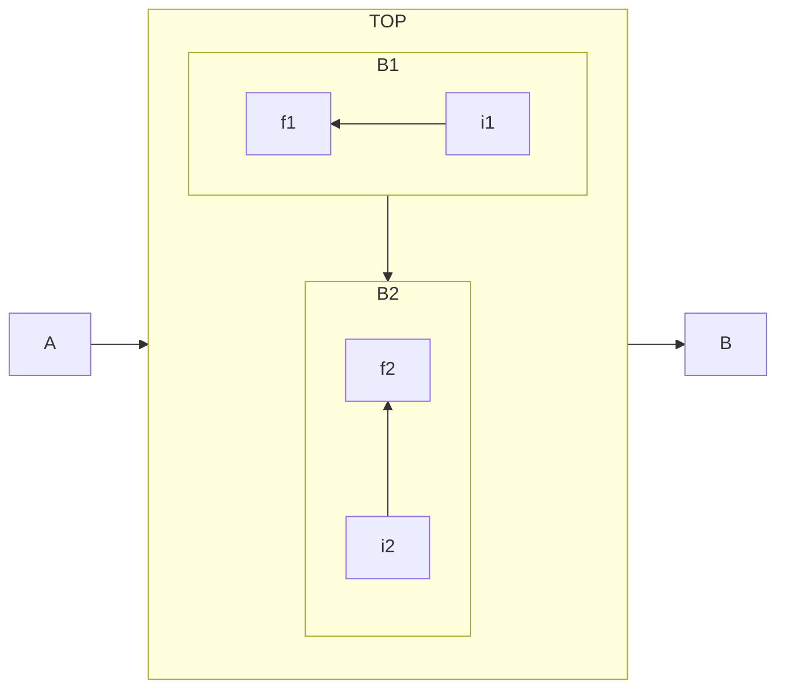
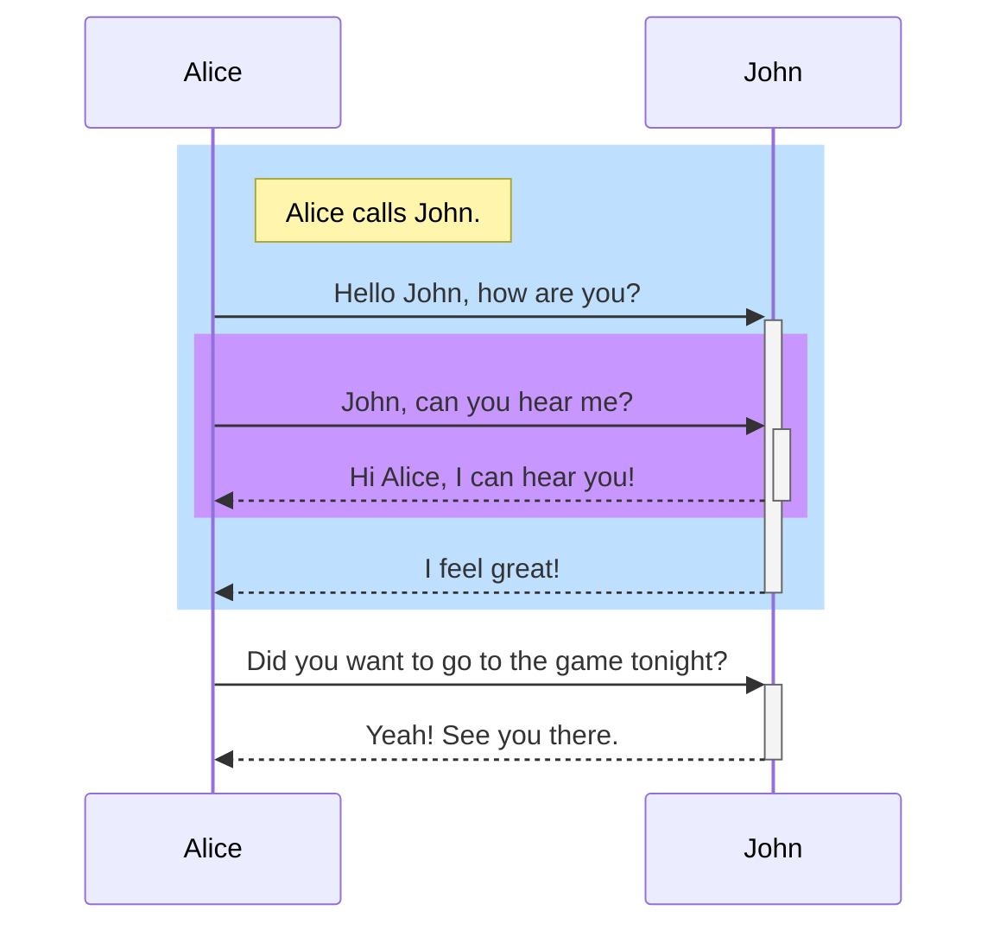

# Welcome to Docsify Page!

This site was created using [**Docsify**](https://docsify.js.org), which is an open source documentation site generator, and imported in GitHub page. This site was created for [**PureSourceCode.com**](https://www.puresourcecode.com/) demo.

Demo website [here](https://erossini.github.io/docsify-template/).

## Feature
In this template for Docsify, you have the basic implementation plus few plugins:

- Full index search. This plugin ignores diacritical marks when performing a full text search (e.g., "cafe" will also match "café"). Legacy browsers like IE11 require the following [String.normalize()](https://developer.mozilla.org/en-US/docs/Web/JavaScript/Reference/Global_Objects/String/normalize) polyfill library to ignore diacritical marks
- Zoom on images
- Pagination
- Reading progress bar
- Mermaid

## Examples

### Mermaid







### Chart with charty

#### Area

```charty
{
  "title":   "Area chart",
  "caption": "With a caption",
  "type":    "area",
  "options": {
    "legend":  true,
    "labels":  true,
    "numbers": true
  },
  "data": [
    {
        "label": "2010",
        "value": [120, 23, 45, 34, 52, 43, 59, 40]
     }
  ]
}
```

#### Radar

```charty
{
  "title":   "Radar chart",
  "caption": "With a caption",
  "type":    "radar",
  "options": {
    "legend":  true,
    "labels":  true,
    "numbers": true
  },
  "data": [
    {
        "label": "iPhone",
        "value": [64, 23, 45, 34, 52, 43, 59, 40],
        "points": [
            "Features",
            "Style",
            "Usability",
            "Ratings",
            "Apps",
            "Softness",
            "Ruggedness",
            "Appeal"
        ]
    },
    {
        "label": "Android",
        "value": [86, 53, 55, 66, 80, 46, 49, 40]
    },
    {
        "label": "Chrome",
        "value": [100, 35, 76, 90, 36, 9, 0, 90]
    }
  ]
}
```

#### Pie

```charty
{
  "title":   "Pie chart",
  "caption": "With a caption",
  "type":    "pie",
  "options": {
    "legend":  true,
    "labels":  true,
    "numbers": true
  },
  "data": [
      { "label": "2012", "value": 1024 },
      { "label": "2010", "value": 200 },
      { "label": "2011", "value": 560 }
  ]
}
```